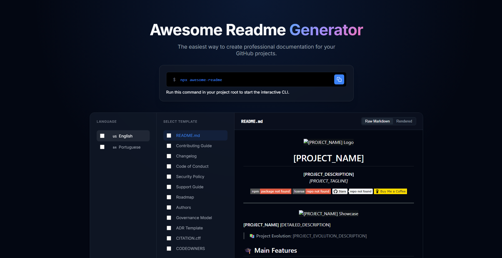

<p align="center">
  
</p>

<h1 align="center">Awesome Readme Templates</h1>

<p align="center">
  <strong>Professional and reusable README templates for GitHub projects.</strong><br>
  <em>Create stunning documentation in minutes with our bilingual templates (EN/PT).</em>
</p>

<p align="center">
  <a href="https://www.npmjs.com/package/awesome-readme-templates" target="_blank">
    
  </a>
  <a href="https://github.com/GabrielBaiano/awesome-readme/blob/main/LICENSE">
    
  </a>
  <a href="https://github.com/GabrielBaiano/awesome-readme/stargazers">
    
  </a>
  <a href="https://buymeacoffee.com/GabrielBaiano" target="_blank">
    
  </a>
</p>

---

<p align="center">
  
</p>


**Awesome Readme Templates** helps you create professional documentation for your projects without the hassle of writing everything from scratch. Choose from a variety of templates and get started instantly.

**[Check the live site here!](https://awesome-readme-nu.vercel.app/)**


> 📚 **Project Evolution**: Started as a simple template collection, now evolved into a powerful CLI tool to scaffold documentation for any project.

<!-- DOCUMENTATION_SECTION -->


## 🎓 Main Features

* **Bilingual Support**: Ready-to-use templates in English and Portuguese (PT-BR).
* **CLI Generator**: Interactive command-line tool `awesome-readme` to easily setup your docs.
* **Extensible**: Modular design allowing easy addition of new sections and templates.
* **Zero Dependencies**: Lightweight and fast, built with pure Node.js.

## 🛠️ Technologies Used

* **Framework**: Node.js
* **Language**: JavaScript (ESM)
* **Libraries**: Native Node.js modules (fs, path, readline).
* **Structure**: Modular architecture with centralized configuration.

## 📖 How to Use and Install

Installation is simple and straightforward via NPM.

1. **Install with npx**:
   ```bash
   npx awesome-readme-templates
   ```
   This will immediately start the interactive CLI.

2. **Global Installation**:
   ```bash
   npm install -g awesome-readme-templates
   awesome-readme
   ```

3. **Check Installation**:
   Run `awesome-readme --help` to see available options.

## 🌐 Customization

**Awesome Readme Templates** allows you to choose exactly what you need:

### Method 1: Interactive Mode

1. Run `npx awesome-readme-templates`.
2. Select **Interactive Selection**.
3. Choose your preferred language (English or Portuguese).
4. Select the templates you want (README, Contributing, Changelog, etc.).
5. Confirm and write files to your project.

### Method 2: Automated Mode (Flags)

1. Use CLI flags to skip menus.
   ```bash
   awesome-readme --lang=en --all
   ```
2. Or specify templates:
   ```bash
   awesome-readme --lang=pt --readme --contributing
   ```

### Supported Templates:
- **README.md**: Complete project documentation.
- **CONTRIBUTING.md**: Guidelines for contributors.
- **CHANGELOG.md**: History of changes.
- **CODE_OF_CONDUCT.md**: Community standards.
- **SECURITY.md**: Security policies.
- **GitHub Files**: PR templates, Issue templates, Funding, etc.

## 💻 For Developers

If you want to clone the repository and run the project locally:

```bash
# 1. Clone the repository
git clone https://github.com/GabrielBaiano/awesome-readme.git

# 2. Navigate to the project folder
cd awesome-readme

# 3. Install dependencies
npm install

# 4. Run in development mode
npm start

# 5. To create installers (if applicable) or test CLI locally
npm link
awesome-readme
```

## 📚 Perfect for Developers

- **Open Source Maintainers**: Quickly standardize your repo docs.
- **Freelancers**: Deliver professional documentation to clients.
- **Students**: Learn best practices for project documentation.
- **Teams**: Ensure consistency across all company repositories.

## 🤝 Contributing

Contributions are welcome! Feel free to submit a Pull Request. Check out our `CONTRIBUTING.md` for more details.

## 📄 License

This project is licensed under the MIT License.

---

<p align="center">
  Made with ❤️ by <a href="https://github.com/GabrielBaiano" target="_blank">GabrielBaiano</a>
</p>
