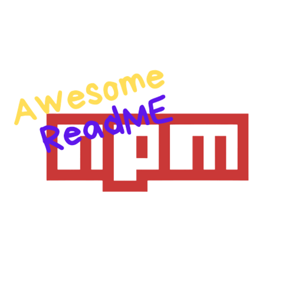

  

<h1 align="center">Awesome README Templates</h1>

  <strong>Professional and reusable README templates for GitHub projects.</strong> 
  <em>Create stunning documentation in minutes with our bilingual templates (EN/PT).</em>

  <a href="./pt/README.md" target="_blank">🇧🇷 Português</a>
  &nbsp;&nbsp;&nbsp;|&nbsp;&nbsp;&nbsp;
  <a href="https://www.npmjs.com/package/awesome-readme-templates" target="_blank">📚 NPM Package</a>
  &nbsp;&nbsp;&nbsp;|&nbsp;&nbsp;&nbsp;
  <a href="https://github.com/GabrielBaiano/awesome-readme/issues" target="_blank">🐛 Report Bug</a>
  &nbsp;&nbsp;&nbsp;|&nbsp;&nbsp;&nbsp;
  <a href="https://github.com/GabrielBaiano" target="_blank">💼 GitHub Profile</a>

  
  
  
  

---

  Made with ❤️ by <a href="https://github.com/GabrielBaiano" target="_blank">GabrielBaiano</a>

