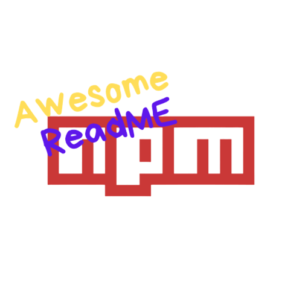

<p align="center">
  
</p>

<h1 align="center">Awesome README Templates</h1>

<p align="center">
  <strong>Plantillas profesionales y reutilizables de README para proyectos de GitHub.</strong><br>
  <em>Crea documentación impactante en minutos con nuestras plantillas multilingües (EN/PT/ES).</em>
</p>

<p align="center">
  <a href="../README.md">🇺🇸 English</a>
  &nbsp;&nbsp;&nbsp;|&nbsp;&nbsp;&nbsp;
  <a href="../pt/README.md">🇧🇷 Português</a>
  &nbsp;&nbsp;&nbsp;|&nbsp;&nbsp;&nbsp;
  <a href="https://awesome-readme-nu.vercel.app/" target="_blank">🌐 Live Dashboard</a>
  &nbsp;&nbsp;&nbsp;|&nbsp;&nbsp;&nbsp;
  <a href="https://www.npmjs.com/package/awesome-readme-templates" target="_blank">📚 Paquete NPM</a>
</p>

<p align="center">
  <a href="https://www.npmjs.com/package/awesome-readme-templates" target="_blank">
    
  </a>
  <a href="https://github.com/GabrielBaiano/awesome-readme/blob/main/LICENSE">
    
  </a>
  <a href="https://github.com/GabrielBaiano/awesome-readme/stargazers">
    
  </a>
  <a href="https://buymeacoffee.com/gabrielngal" target="_blank">
    
  </a>
</p>

---

**Awesome README Templates** es una colección de plantillas de documentación multilingüe (Inglés, Portugués y Español) de alta calidad, diseñada para ayudar a desarrolladores a crear documentación profesional sin fricciones. Incluye una herramienta CLI para generar y configurar tus archivos al instante.

## 🚀 Características

* **🧙 CLI Interactiva**: Asistente en terminal para guiarte en la configuración.
* **🌐 Soporte Multilingüe**: Soporte nativo para Inglés, Portugués y Español.
* **📂 Organización Inteligente**: En modo multilingüe, los archivos en otros idiomas se guardan automáticamente en carpetas como `pt/` y `es/`.
* **🛡️ Seguridad Primero**: La CLI verifica archivos existentes para prevenir sobreescrituras accidentales.
* **📦 Colección Completa**: Incluye README, CONTRIBUTING, CHANGELOG, SECURITY y plantillas de GitHub.
* **📜 Gestor de Licencias**: Selección de licencias abiertas populares (MIT, Apache, GPL, etc.).
* **🤖 Automatización por Flags**: Soporte completo de flags para flujos de CI/CD o scaffolding rápido.

## 📥 Instalación

Puedes ejecutar la herramienta directamente con `npx` sin instalación previa:

```bash
npx awesome-readme-templates
```

O instalarla globalmente:

```bash
npm install -g awesome-readme-templates
```

## 📖 Uso

### Modo Interactivo (Asistente)

Ejecuta el comando y sigue las instrucciones:

```bash
awesome-readme
```

El asistente te solicitará:
1. **Seleccionar Idioma**: Inglés, Portugués o Español (o varios).
2. **Seleccionar Estilo de README**: Standard, Minimalist o Complete.
3. **Seleccionar Licencia**: Elección de una lista curada (MIT, Apache, GPL, etc.).
4. **Seleccionar Extras**: Guía de contribución, changelog, política de seguridad, workflows de GitHub, etc.

### Modo Automatizado (Flags de CLI)

Ideal para scripts o usuarios que prefieren rapidez:

```bash
# Ejemplo: Crear proyecto en español con plantillas de GitHub y licencia MIT
awesome-readme --main-lang es --with-github --license mit

# Ejemplo: Instalar todas las plantillas en modo multilingüe
awesome-readme --main-lang es --langs en,pt --all
```

**Flags Principales:**
* `--main-lang <en|pt|es>`: Define el idioma principal en la raíz del proyecto.
* `--langs <en,pt,es>`: Lista de idiomas adicionales separados por coma.
* `--license <name>`: Selecciona la licencia (ej. `mit`, `apache`).
* `--all`: Instala todas las plantillas disponibles.
* `--with-<template>`: Instala una plantilla o grupo específico (ej. `--with-github`, `--with-security`).

## 📂 Plantillas Incluidas

* **README.md**: La carta de presentación de tu proyecto.
* **CONTRIBUTING.md**: Pautas para colaboradores y estilos de código.
* **CHANGELOG.md**: Historial cronológico de cambios y versiones.
* **SECURITY.md**: Políticas de divulgación responsable de vulnerabilidades.
* **.github/**: Plantillas de Pull Requests, Issues y Workflows de Actions.

## 🤝 Contribuir

¡Las contribuciones son bienvenidas! Consulta nuestra [Guía de Contribución](./CONTRIBUTING.es.md) para más detalles.

## 📄 Licencia

Este proyecto está bajo la [Licencia MIT](../LICENSE).

---

<p align="center">
  Hecho con ❤️ por <a href="https://github.com/GabrielBaiano" target="_blank">GabrielBaiano</a>
</p>
